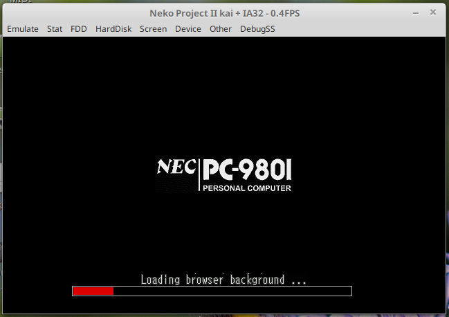
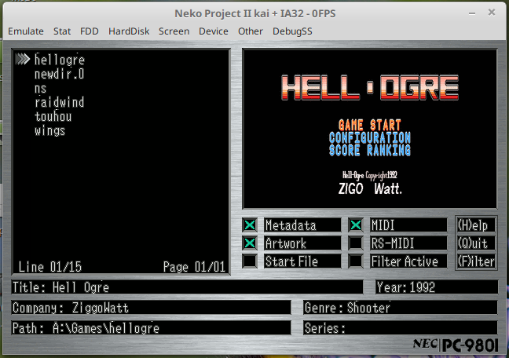

# PC98Launcher

## What is it?

PC98Launcher is graphical game browser and launcher for the PC-98 range of personal computers from NEC.

It runs on the PC-98 hardware itself, either emulated or real physical system; it is __not__ a Window/Mac/Linux application like [launchbox](https://www.launchbox-app.com/) or [RetroArch](https://github.com/libretro/RetroArch).

Specifically, it is written to use the 256 colour graphics hardware found on late PC-9801 and early to late PC-9821 machines.

   * It creates a browseable list of all the game directories on your drive(s)
   * It can load and display additional metadata per game (i.e developer, genre, release date etc)
   * It can load and display screenshots or artwork per game (i.e box art, screenshots, etc)
   * It can export an audit file of all the found games
   * It can launch any game for which a start file is either found (e.g. start.bat), or which has been defined in metadata (e.g. run.com, go.exe, etc)

## What does it look like?

Starting up and scanning for games:



Main user interface:



Browsing game artwork:


----

## How do I run it?

You will need a system that meets these requirements:

   * A PC-9801 or PC-9821 with the 256 colour PEGC graphics hardware
   * A minimum of 4MB of RAM
   * A hard drive
   * A VCPI (EMM386 or VEM486) and DPMI server (DPMI.EXE from PC-98 DOS 6.22 works well)

You then need to copy the zipped binaries (see below) to a location on your PC-98 hard drive and unzip them to a directory of your choice.

The directory should have the following after unzipping:

   * launcher.exe
   * launcher.ini
   * dpmi.exe
   * go32-v2.exe
   * assets\font8x16.bmp
   * assets\logo.bmp
   * assets\light\\*.bmp

You don't need to set anything in config.sys or autoexec.bat.

Edit launcher.ini with a normal text editor and set the `gamedirs` variable to all of the locations of games on your hard drive(s).

If you have your games under folders such as `A:\Games\Arkanoid` and `A:\Games\Dark` for example, then you only need to add the path `A:\Games`. You may add up to 16 comma seperated game paths.

Just run `dpmi.exe` and then `launcher.exe` to start the user interface. Alternatively, add those two commands to the end of your autoexec.bat to have the interface start automatially at boot.


#### Binaries

The latest pre-compiled binaries as well as pre-made metadata and screenshots can be found on my website under the [Tech Stuff](https://www.target-earth.net/wiki/doku.php?id=blog:tech#retro_computing_gaming) wiki:

   * [www.target-earth.net - Tech Stuff wiki](https://www.target-earth.net/wiki/doku.php?id=blog:tech)

----

## How to build

The code for PC98Launcher is all standard ANSI C, built using GCC and a custom version of DJGPP targetting the PC-98 hardware, rather than PC/DOS hardware.

A full guide of how to set up a build environment is on my wiki:

   * [www.target-earth.net - PC-98 Dev tools wiki](https://www.target-earth.net/wiki/doku.php?id=blog:pc98_devtools)


----

## Adding metadata & images


### Converting images to useable BMP files

The BMP files used by the application need to be 8bpp but of a limited palette so that the user interface does not suffer from colour issues (approximately 40 colours are reserved by the user interface and fonts).

You can use any image processing application you want, but it must output images of the following specifications:

   * BMP
   * Uncompressed
   * 8bpp, indexed/paletted colour
   * Maximum of 208 colours
   * No larger than 320x200 (but they may be smaller in either dimension, if desireable, e.g. for boxart)


If you have the [ImageMagick](https://www.imagemagick.org/) tools available on your system, you can batch convert files using the following syntax:

```
convert INPUT.JPG -resize 320x200 -depth 8 -colors 208 -alpha OFF -compress none BMP3:OUTPUT.BMP
```